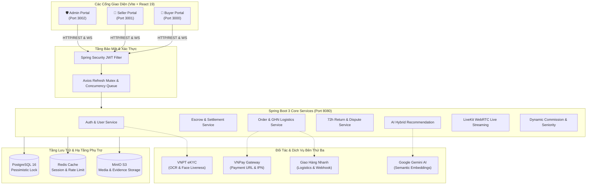

# NỀN TẢNG THƯƠNG MẠI ĐIỆN TỬ ĐỒ CÔNG NGHỆ (FULLSTACK)
## Smart Multi-Vendor Tech Marketplace — Group G87 (SEP490)

> Hệ thống Thương mại Điện tử Đa phân hệ chuyên sâu cho thiết bị công nghệ và linh kiện điện tử, tích hợp ký quỹ tự động (**Escrow Protection**), xác thực danh tính sinh trắc học (**VNPT eKYC**), phát trực tiếp bán hàng (**LiveKit WebRTC**), đề xuất thông minh (**Hybrid AI Recommendations**) và phân định khiếu nại hoàn trả minh bạch.

---

## 🏛️ CẤU TRÚC KIẾN TRÚC ĐA CỔNG (4-TIER ARCHITECTURE)

Hệ thống được thiết kế theo mô hình phân tách hoàn toàn giữa Backend API và 3 Cổng giao diện chuyên biệt cho từng tác nhân:

| Phân hệ | Thư mục mã nguồn | Công nghệ chủ đạo | Cổng mặc định (Port) | Vai trò chức năng chính |
|:---|:---|:---|:---:|:---|
| **Backend Core API** | `ecommerce/` | Java 21, Spring Boot 3, PostgreSQL, Redis, MinIO, STOMP | **8080** | Cung cấp RESTful APIs, WebSocket server, xử lý nghiệp vụ Escrow, tính hoa hồng, Cron jobs |
| **Buyer Portal** | `ecommerce-fe/` | React 19, Vite, Tailwind CSS v4, Zustand, Axios Mutex | **3000** | Trải nghiệm mua sắm, tìm kiếm AI, giỏ hàng, thanh toán VNPay, theo dõi đơn GHN, khiếu nại trả hàng |
| **Seller Portal** | `ecommerce-seller-fe/` | React 19, Vite, Tailwind CSS v4, LiveKit Client | **3001** | Onboarding sinh trắc học eKYC, quản lý kho đồ công nghệ, xử lý đơn hàng GHN, thẩm định hàng hoàn 72h |
| **Admin Portal** | `ecommerce-admin-fe/` | React 19, Vite, Tailwind CSS v4, Headless UI | **3002** | Phân xử tranh chấp bồi hoàn, phê duyệt shop, điều chỉnh biểu phí hoa hồng sàn, giám sát ví sàn |



---

## 🌟 ĐẶC TẢ CÁC ĐỘT PHÁ NGHIỆP VỤ CỐT LÕI

### 1. Vòng đời Token JWT & Hàng đợi Làm mới Đồng thời (Concurrency Mutex)
- **Cơ chế:** Token truy cập ngắn hạn (`JWT_EXPIRATION`), Token làm mới dài hạn (`JWT_REFRESH_EXPIRATION`).
- **Xử lý Đua tranh (Race Condition):** Khi nhiều API đồng thời nhận lỗi `401 Unauthorized`, hệ thống kích hoạt **Mutex Flag**: chỉ 1 request duy nhất được phép gọi `/api/v1/auth/refresh-token`, các request còn lại được đẩy vào hàng đợi (Pending Queue) và tự động thực thi lại sau khi có Access Token mới.
- **Auto-Logout Triệt để:** Nếu Refresh Token hết hạn hoặc bị từ chối, toàn bộ `localStorage` được xóa sạch, state Zustand bị reset về trạng thái ban đầu và điều hướng tức thời về màn hình Login tương ứng với từng Portal mà không bị kẹt vòng lặp vô tận.

### 2. Định danh Người bán bằng Sinh trắc học (VNPT eKYC Onboarding)
- **Quy trình bắt buộc:** Người bán muốn mở cửa hàng phải hoàn thành kiểm định eKYC qua 4 bước:
  1. `POST /api/v1/kyc/sessions:start`: Khởi tạo phiên định danh bảo mật.
  2. `POST /api/v1/kyc/sessions/{id}/ocr/front & back`: Nhận diện bóc tách thông tin thẻ CCCD gắn chip.
  3. `POST /api/v1/kyc/sessions/{id}/ocr/liveness`: Xác thực video/ảnh khuôn mặt sống chống giả mạo Deepfake.
  4. `POST /api/v1/kyc/sessions/{id}/compare`: So khớp tỷ lệ tương đồng giữa ảnh chân dung và ảnh trên CCCD.
- **Tiêu chuẩn an toàn:** Chỉ khi độ tin cậy vượt ngưỡng quy định, hệ thống mới cho phép gửi yêu cầu `RequestType.REGIS_SELLER` tới Admin.

### 3. Ký quỹ Giao dịch Tự động (Escrow & Financial Settlement)
- **Bảo vệ dòng tiền:** Tiền thanh toán của Người mua (qua VNPay hoặc Ví) được khóa chặt trong tài khoản Escrow của sàn.
- **Giải phóng tiền an toàn (Release Trigger):**
  * **Chủ động:** Người mua nhận hàng, kiểm tra linh kiện và bấm nút **"Xác nhận đã nhận hàng"** (`PATCH /api/v1/order/{id}/received`) $\rightarrow$ Tiền chuyển ngay vào ví Người bán sau khi trừ phí hoa hồng sàn.
  * **Tự động (Cron Job):** Sau **7 ngày** kể từ khi đơn hàng ở trạng thái `DELIVERED`, nếu người mua không gửi khiếu nại, hệ thống tự động giải phóng tiền cho người bán.

### 4. Quy trình Hoàn trả 72 Giờ & Phân xử Tranh chấp Đồ Công nghệ (Return & Dispute)
- **Cơ chế "AS-IS" đặc thù:** Đồ công nghệ cũ rất nhạy cảm với việc bị đánh tráo linh kiện (RAM, Chip, Màn hình, Pin).
- **Hạn định 72h Thẩm định (72h Inspection Window):**
  * Khi kiện hàng hoàn được shipper giao lại về kho của Người bán, trạng thái chuyển thành `DELIVERED_TO_SELLER`.
  * Người bán có đúng **72 giờ** để mở hộp, kiểm tra tính nguyên vẹn và đưa ra quyết định:
    - **Chấp thuận (`/complete`):** Hệ thống lập tức hoàn tiền về Ví người mua (`REFUNDED`).
    - **Khiếu nại tráo hàng/hư hại (`/dispute`):** Người bán đính kèm hình ảnh/video bằng chứng mở hộp để chuyển trạng thái sang `DISPUTED`.
  * **Cron Job bảo vệ người mua:** Nếu quá 72 giờ mà Người bán không bấm xác nhận hay khiếu nại, hệ thống sẽ tự động coi như hàng đã hợp lệ và tự động hoàn tiền cho Người mua.
- **Phân xử Trọng tài (Admin Arbitration):** Đội ngũ Quản trị viên sàn thẩm tra bằng chứng đối chiếu giữa 2 bên tại `Admin Portal` và ra phán quyết cuối cùng (`ADMIN_RESOLVED`).

### 5. Thuật toán Gợi ý Lai 3 Tầng (3-Tier Hybrid Recommendation)
1. **Tầng 1 (Content-based Specs):** Sử dụng Vector Embeddings biểu diễn thông số kỹ thuật (CPU, RAM, GPU, Tình trạng 99%/Like New).
2. **Tầng 2 (Collaborative Filtering):** Dựa trên ma trận lịch sử click xem (`product_views`), thêm vào giỏ và lịch sử mua sắm tương quan giữa các người dùng.
3. **Tầng 3 (Business Re-ranking):** Tái xếp hạng ưu tiên các sản phẩm có điểm uy tín Shop cao, số lượng hoàn trả thấp và còn sẵn hàng trong kho.

### 6. Phòng Phát Trực Tiếp Đồ Công Nghệ (LiveKit WebRTC Streaming)
- Tích hợp chuẩn WebRTC độ trễ siêu thấp (< 500ms) thông qua máy chủ LiveKit.
- Cho phép Người bán mở phòng live, vừa thuyết trình vừa pin trực tiếp thông số và link mua nhanh sản phẩm lên góc màn hình người xem.

---

## ⚙️ CẤU HÌNH BIẾN MÔI TRƯỜNG TOÀN DIỆN (.ENV)

### 1. Cấu hình Backend (`E-commerce/ecommerce/.env`)

Tạo file `ecommerce/.env` từ danh sách biến dưới đây:

```env
# ==============================================================================
# HẠ TẦNG CƠ SỞ DỮ LIỆU & DỊCH VỤ NỀN TẢNG
# ==============================================================================
POSTGRES_DB=ecommerce_db
POSTGRES_USER=postgres
POSTGRES_PASSWORD=postgres
POSTGRES_PORT=5432

REDIS_HOST=localhost
REDIS_PORT=6379

MINIO_ROOT_USER=minioadmin
MINIO_ROOT_PASSWORD=minioadmin
MINIO_API_PORT=9000
MINIO_CONSOLE_PORT=9001
MINIO_BUCKET_NAME=ecommerce

# ==============================================================================
# BẢO MẬT & JWT (JSON WEB TOKEN)
# ==============================================================================
JWT_SECRET=404E635266556A586E3272357538782F413F4428472B4B6250645367566B5970
JWT_EXPIRATION=86400000          # 1 Ngày (ms)
JWT_REFRESH_EXPIRATION=604800000 # 7 Ngày (ms)

# ==============================================================================
# TÍCH HỢP BÊN THỨ BA (PAYMENT / LOGISTICS / EKYC / STREAMING)
# ==============================================================================
# VNPAY Sandbox
VNPAY_TMN_CODE=TESTCODE
VNPAY_HASH_SECRET=TESTSECRETKEY
VNPAY_URL=https://sandbox.vnpayment.vn/paymentv2/vpcpay.html
VNPAY_RETURN_URL=http://localhost:3000/payment/vnpay-return

# Giao Hàng Nhanh (GHN Sandbox)
GHN_URL=https://dev-online-gateway.ghn.vn/shiip/public-api
GHN_TOKEN=your_ghn_sandbox_token_here
GHN_SHOP_ID=your_ghn_shop_id_here

# VNPT eKYC
VNPT_EKYC_BASE_URL=https://api.vnpt.vn/ekyc
VNPT_EKYC_ACCESS_TOKEN=your_vnpt_access_token
VNPT_EKYC_TOKEN_ID=your_vnpt_token_id
VNPT_EKYC_TOKEN_KEY=your_vnpt_token_key

# LiveKit WebRTC
LIVEKIT_URL=ws://localhost:7880
LIVEKIT_API_KEY=devkey
LIVEKIT_API_SECRET=secret

# Google Gemini AI
GEMINI_API_KEY=your_gemini_api_key_here
GEMINI_VERSION=v1beta

# Mail Service
MAIL_HOST=smtp.gmail.com
MAIL_PORT=587
MAIL_USERNAME=your_email@gmail.com
MAIL_PASSWORD=your_app_password

# Frontend URL Allowed Origins
FRONTEND_URL=http://localhost:3000
SELLER_FRONTEND_URL=http://localhost:3001
APPEAL_WINDOW_HOURS=72
```

### 2. Cấu hình Frontend Người mua (`E-commerce/ecommerce-fe/.env`)

```env
VITE_API_URL=http://localhost:8080
VITE_API_BASE_URL=http://localhost:8080
VITE_LIVEKIT_WS_URL=ws://localhost:7880
```

### 3. Cấu hình Frontend Người bán (`E-commerce/ecommerce-seller-fe/.env`)

```env
VITE_API_URL=http://localhost:8080
VITE_API_BASE_URL=http://localhost:8080
VITE_LIVEKIT_WS_URL=ws://localhost:7880
```

### 4. Cấu hình Frontend Quản trị (`E-commerce/ecommerce-admin-fe/.env`)

```env
VITE_API_URL=http://localhost:8080
VITE_API_BASE_URL=http://localhost:8080
```

---

## 📋 TÀI KHOẢN MẪU KHỞI TẠO SẴN (SEED DEMO CREDENTIALS)

Khi khởi động lần đầu, `DataInitializer.java` tự động cấu hình các tài khoản mẫu sẵn sàng phục vụ kiểm thử:

| Phân hệ / Cổng truy cập | Username | Password | Role | Tên người dùng / Đơn vị | Ghi chú kiểm thử |
|:---|:---|:---|:---:|:---|:---|
| **Admin Portal (3002)** | `admin` | `admin123@` | `ADMIN` | Quản Trị Viên Sàn E-commerce | Quản lý hoa hồng, duyệt shop, phân xử khiếu nại hoàn trả |
| **Seller Portal (3001)** | `seller1` | `seller123@` | `BUSINESS` | Nguyễn Thành Đạt (Apple Official) | Có sẵn kho iPhone/MacBook, kiểm tra kiện hàng hoàn 72h |
| **Seller Portal (3001)** | `seller2` | `seller123@` | `BUSINESS` | Trần Quang Huy (Samsung Experience) | Quản lý kho Galaxy/Tab, tạo đơn giao vận GHN |
| **Buyer Portal (3000)** | `customer1` | `customer123@` | `CUSTOMER` | Lê Văn Mua Hàng | Có sẵn ví tiền, đơn hàng chờ nhận và đơn yêu cầu trả hàng |
| **Buyer Portal (3000)** | `customer2` | `customer123@` | `CUSTOMER` | Phạm Thị Mua Sắm | Có sẵn địa chỉ giao hàng mẫu tại TP.HCM |

---

## 🏃 HƯỚNG DẪN KHỞI CHẠY HỆ THỐNG CHI TIẾT

### Bước 1: Khởi động Docker Containers
```bash
cd ecommerce
docker compose up -d
```
Kiểm tra các container đã chạy:
```bash
docker compose ps
```

### Bước 2: Khởi động Backend Spring Boot
Mở terminal 1:
```bash
cd ecommerce
# Trên Windows:
.\mvnw.cmd spring-boot:run
# Trên Linux/macOS:
./mvnw spring-boot:run
```
Backend lắng nghe tại: `http://localhost:8080`.

### Bước 3: Khởi động Cổng Người Mua (Port 3000)
Mở terminal 2:
```bash
cd ecommerce-fe
npm install
npm run dev
```

### Bước 4: Khởi động Cổng Người Bán (Port 3001)
Mở terminal 3:
```bash
cd ecommerce-seller-fe
npm install
npm run dev
```

### Bước 5: Khởi động Cổng Quản Trị Sàn (Port 3002)
Mở terminal 4:
```bash
cd ecommerce-admin-fe
npm install
npm run dev
```

---

## ⏰ BẢNG TÁC VỤ ĐỊNH KỲ (SCHEDULED CRON JOBS)

Hệ thống kích hoạt các tác vụ nền định kỳ (`@Scheduled`) nhằm đảm bảo tính tự động hóa và toàn vẹn tài chính:

| Lớp xử lý | Biểu thức Cron | Tần suất | Chức năng nghiệp vụ tự động |
|:---|:---:|:---:|:---|
| `OrderReturnServiceImpl` | `0 */10 * * * *` | 10 phút / lần | Tự động hủy yêu cầu hoàn trả nếu Người mua không điền mã vận đơn hoàn sau thời hạn quy định |
| `OrderReturnServiceImpl` | `0 */10 * * * *` | 10 phút / lần | **Bảo vệ người mua:** Tự động hoàn tiền nếu Người bán đã nhận lại hàng quá 72h mà không bấm xác nhận hay khiếu nại |
| `OrderServiceImpl` | `0 0 * * * *` | Mỗi giờ | **Tự động giải phóng Ký quỹ Escrow:** Chuyển tiền từ tài khoản Escrow sang Ví Người bán sau 7 ngày kể từ khi giao hàng thành công mà không có khiếu nại |
| `RequestServiceImpl` | `0 0 * * * *` | Mỗi giờ | Tự động xử lý và giải quyết các khiếu nại (Report) bị quá hạn phản hồi |
| `ShopEscrowFundServiceImpl`| `0 0 * * * *` | Mỗi giờ | Quét hạn mức nộp bù quỹ ký quỹ cố định của Shop; tự động giới hạn quyền bán nếu vi phạm thời hạn |

---

## 🔗 DANH MỤC TÀI LIỆU CHI TIẾT TỪNG PHÂN HỆ

- ⚙️ [Hướng dẫn chi tiết Backend Spring Boot 3](file:///c:/Users/ad/OneDrive/Desktop/ĐATN/E-commerce/ecommerce/README.md)
- 🛒 [Hướng dẫn chi tiết Cổng Người Mua (Buyer Portal)](file:///c:/Users/ad/OneDrive/Desktop/ĐATN/E-commerce/ecommerce-fe/README.md)
- 🏪 [Hướng dẫn chi tiết Cổng Người Bán (Seller Portal)](file:///c:/Users/ad/OneDrive/Desktop/ĐATN/E-commerce/ecommerce-seller-fe/README.md)
- 🛡️ [Hướng dẫn chi tiết Cổng Quản Trị (Admin Portal)](file:///c:/Users/ad/OneDrive/Desktop/ĐATN/E-commerce/ecommerce-admin-fe/README.md)
