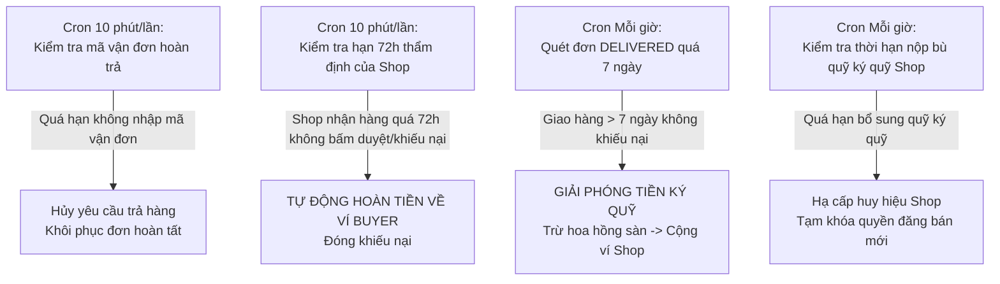

# TÀI LIỆU KỸ THUẬT PHÂN HỆ BACKEND API (SPRING BOOT 3)
## E-commerce Core Engine — Java 21 & High-Concurrency Architecture

> Phân hệ Backend đóng vai trò hạt nhân trung tâm của nền tảng, chịu trách nhiệm quản lý nghiệp vụ tài chính ký quỹ (**Escrow**), khóa đồng thời kiểm soát tồn kho (**Pessimistic Locking**), xác thực danh tính sinh trắc học (**VNPT eKYC**), tính toán hoa hồng động (**Dynamic Commission**), điều phối đơn vị vận chuyển (**GHN**) và phát sóng tương tác trực tiếp (**LiveKit WebRTC**).

---

## 🛠️ CÔNG NGHỆ & THƯ VIỆN NỀN TẢNG

- **Ngôn ngữ & Runtime:** Java 21 LTS (sử dụng các tính năng hiện đại: Virtual Threads, Pattern Matching, Record, Text Blocks)
- **Framework chính:** Spring Boot 3.3.x (Spring Web, Spring Security, Spring Data JPA, Spring WebSocket)
- **Hệ quản trị CSDL:** PostgreSQL 16 (Hỗ trợ ACID, JSONB, Full-text Search)
- **Hệ thống Cache & Bộ nhớ đệm:** Redis 7 (Quản lý phiên, rate limit và token blacklist)
- **Lưu trữ đối tượng (Object Storage):** MinIO S3 Compatible Storage (Lưu trữ ảnh sản phẩm, bằng chứng khiếu nại)
- **Giao tiếp Thời gian thực (Real-time):** STOMP qua SockJS WebSocket (`/api/v1/ws-chat`)
- **Tích hợp bên ngoài:**
  * Cổng thanh toán: **VNPay Sandbox** (HMAC-SHA512 verification)
  * Đơn vị giao vận: **Giao Hàng Nhanh (GHN Open API)**
  * Xác thực sinh trắc: **VNPT eKYC Gateway** (OCR & Face Liveness API)
  * Livestreaming: **LiveKit Server SDK** (WebRTC SFU)
  * Trí tuệ nhân tạo: **Google Gemini v1beta** (Semantic embeddings & AI Chatbot)

---

## 🏛️ KIẾN TRÚC MÃ NGUỒN THEO TẦNG VÀ PHÂN KHU NGHIỆP VỤ

Mã nguồn được cấu trúc theo mô hình **Domain-Driven Design (DDD)** kết hợp **Layered Architecture**:

```text
src/main/java/com/marketplace/ecommerce/
├── auth/                 # Định danh, Tài khoản, Phân quyền, JWT & Địa chỉ người dùng
│   ├── controller/       # AuthController, UserController, AddressController
│   ├── entity/           # Account, User, Role, UserAddress, RefreshToken
│   └── service/          # AuthService, JwtService, UserDetailsService
├── cart/                 # Giỏ hàng & Quản lý sản phẩm trong giỏ
├── checkout/             # Báo giá (Quote), Áp dụng Voucher & Xác nhận thanh toán
├── order/                # Quản lý Đơn hàng, Trả hàng (Return) & Phân xử tranh chấp
│   ├── controller/       # OrderController, OrderReturnController, ReportController
│   ├── entity/           # Order, OrderItem, OrderReturn, Report
│   └── service/          # OrderService, OrderReturnService, ReportService
├── payment/              # Tích hợp VNPay, Tạo URL thanh toán & Xử lý IPN Webhook
├── platform/             # Quản trị Hoa hồng sàn, Cấu hình phí & Thâm niên nhà bán
│   ├── entity/           # Commission, CommissionItem, PlatformSetting, SeniorityPolicy
│   └── service/          # CommissionCalculationService, PlatformSettingService
├── product/              # Danh mục, Sản phẩm công nghệ, Thuộc tính kỹ thuật & MinIO
├── shop/                 # Hồ sơ Shop, Quỹ ký quỹ cố định (ShopEscrowFund), Điểm uy tín
├── wallet/               # Quản lý Ví điện tử nội bộ, Lịch sử giao dịch & Đối soát
├── kyc/                  # Tích hợp VNPT eKYC (OCR mặt trước/sau, Face Liveness, Match)
├── live/                 # Quản lý phòng LiveKit, Cấp phát Token WebRTC cho Viewer/Host
├── chat/                 # Chatbot AI (Gemini), Cây quyết định & Live STOMP WebSocket
├── shipping/             # Tích hợp GHN (Lấy tỉnh/huyện/xã, tính phí ship, webhook)
└── config/               # SecurityConfig, WebSocketConfig, DataInitializer, MinioConfig
```

---

## 🔒 THIẾT KẾ XỬ LÝ ĐỒNG THỜI & BẢO VỆ DÒNG TIỀN (CONCURRENCY CONTROL)

Trong môi trường thương mại điện tử với các sự kiện Flash Sale và hoàn trả tiền ký quỹ, xung đột dữ liệu (Race Condition) và chi tiêu kép (Double-spending) là rủi ro lớn nhất. Hệ thống áp dụng nghiêm ngặt các biện pháp bảo vệ:

### 1. Khóa Bi quan (Pessimistic Locking) trong Trừ kho & Hoàn kho
- Tại `ProductRepository` và `ProductVariantRepository`, các truy vấn cập nhật tồn kho sử dụng:
  ```java
  @Lock(LockModeType.PESSIMISTIC_WRITE)
  @Query("SELECT p FROM Product p WHERE p.id = :id")
  Optional<Product> findByIdForUpdate(@Param("id") UUID id);
  ```
- **Ý nghĩa:** Khi đơn hàng checkout được xử lý, bản ghi sản phẩm trong cơ sở dữ liệu sẽ bị khóa chặt ở tầng DB (Row-level lock). Không có 2 giao dịch nào có thể cùng lúc mua quá số lượng hàng tồn sẵn có.

### 2. Khóa Giao dịch Ví (Wallet Balance Protection)
- Trong `WalletServiceImpl`, trước khi cộng tiền hoặc trừ tiền ví Người bán/Người mua, hệ thống gọi `findByIdForUpdate` trên bản ghi `Wallet`.
- Đảm bảo việc giải phóng tiền từ Escrow hoặc hoàn tiền khiếu nại (Refund) luôn tuyệt đối chính xác, không thể xảy ra hiện tượng số dư ví bị âm hoặc nhận tiền hai lần.

### 3. Mutex Hàng đợi Refresh Token (Zero Race Condition)
- Khi Access Token hết hạn, hàng loạt API frontend cùng trả về `401 Unauthorized`.
- Backend hỗ trợ endpoint `/api/v1/auth/refresh-token` với cơ chế kiểm tra token duy nhất:
  - Nếu refresh token hợp lệ $\rightarrow$ Cấp cặp token mới và xoay vòng (Rotate) Refresh Token.
  - Ngăn chặn triệt để việc tấn công Replay Attack bằng token cũ.

---

## ⏰ BẢNG ĐẶC TẢ TÁC VỤ ĐỊNH KỲ (SCHEDULED DAEMONS)

Backend tích hợp các tiến trình chạy ngầm định kỳ bằng Spring `@Scheduled`:



| Lớp xử lý | Biểu thức Cron | Tần suất | Chức năng nghiệp vụ chi tiết |
|:---|:---:|:---:|:---|
| `OrderReturnServiceImpl.checkExpiredReturns()` | `0 */10 * * * *` | 10 phút / lần | Quét các yêu cầu trả hàng đã được duyệt nhưng Người mua không cung cấp mã vận đơn GHN trong thời hạn quy định $\rightarrow$ Tự động đóng yêu cầu hoàn trả. |
| `OrderReturnServiceImpl.autoApproveExpiredInspections()` | `0 */10 * * * *` | 10 phút / lần | **Cơ chế bảo vệ người mua:** Quét các kiện hàng hoàn đã giao tới kho người bán (`DELIVERED_TO_SELLER`) quá **72 giờ** mà người bán không xác nhận cũng không khiếu nại $\rightarrow$ Hệ thống tự động giải phóng tiền hoàn về Ví người mua. |
| `OrderServiceImpl.autoReleaseEscrowFunds()` | `0 0 * * * *` | Mỗi giờ | Quét các đơn hàng đã ở trạng thái `DELIVERED` quá **7 ngày** mà người mua không gửi báo cáo sự cố (Report) $\rightarrow$ Tự động chuyển trạng thái `COMPLETED` và giải ngân tiền Escrow vào ví Người bán. |
| `RequestServiceImpl.autoHandleExpiredReports()` | `0 0 * * * *` | Mỗi giờ | Quét các đơn khiếu nại quá hạn xử lý của người bán để tự động can thiệp theo chính sách bảo vệ khách hàng. |
| `ShopEscrowFundServiceImpl.checkPendingReplenishments()` | `0 0 * * * *` | Mỗi giờ | Kiểm tra các Shop bị trừ tiền phạt/bồi thường dẫn đến thâm hụt quỹ ký quỹ cố định; tự động giới hạn quyền năng của Shop nếu không nộp bù trong thời hạn quy định. |

---

## 📡 DANH MỤC RESTFUL API CHÍNH

### 1. Phân hệ Định danh & Tài khoản (`/api/v1/auth`)
- `POST /api/v1/auth/register` — Đăng ký tài khoản mới (Gửi mã xác thực qua Email)
- `POST /api/v1/auth/verify` — Xác thực OTP kích hoạt tài khoản
- `POST /api/v1/auth/login` — Đăng nhập hệ thống (Trả Access Token & Refresh Token)
- `POST /api/v1/auth/refresh-token` — Cấp phát lại Access Token bằng Refresh Token
- `POST /api/v1/auth/logout` — Đăng xuất và vô hiệu hóa Token trong phiên
- `GET /api/v1/auth/users` — *(ADMIN)* Truy vấn danh sách toàn bộ người dùng trong hệ thống

### 2. Phân hệ Xác thực Sinh trắc học (`/api/v1/kyc`)
- `POST /api/v1/kyc/sessions:start` — Khởi tạo phiên kiểm định eKYC
- `POST /api/v1/kyc/session/{id}/upload` — Đẩy hình ảnh giấy tờ lên hệ thống
- `POST /api/v1/kyc/sessions/{id}/ocr/front` — Trích xuất OCR mặt trước CCCD gắn chip
- `POST /api/v1/kyc/sessions/{id}/ocr/back` — Trích xuất OCR mặt sau CCCD (Ngày cấp, đặc điểm nhận dạng)
- `POST /api/v1/kyc/sessions/{id}/ocr/liveness` — Kiểm tra tính sống (Liveness Detection) của khuôn mặt
- `POST /api/v1/kyc/sessions/{id}/compare` — So khớp ảnh selfie và ảnh trên thẻ CCCD
- `GET /api/v1/kyc/sessions/{id}` — Lấy kết quả điểm tin cậy của phiên eKYC

### 3. Phân hệ Quản lý Đơn hàng & Giao vận (`/api/v1/order`)
- `POST /api/v1/order` — Khởi tạo đơn hàng từ giỏ hàng theo từng Shop
- `PATCH /api/v1/order/{orderId}/status` — Cập nhật trạng thái vòng đời đơn hàng
- `PATCH /api/v1/order/{orderId}/received` — Người mua xác nhận đã nhận hàng thành công
- `POST /api/v1/order/{orderId}/ghn/retry` — Thử lại tiến trình đẩy mã vận đơn sang GHN
- `GET /api/v1/order/me` — Lấy danh sách lịch sử đơn hàng của người dùng hiện tại
- `GET /api/v1/order/shops` — *(BUSINESS)* Quản lý danh sách đơn hàng thuộc cửa hàng của mình

### 4. Phân hệ Hoàn trả & Tranh chấp (`/api/v1/returns`)
- `GET /api/v1/returns/order/{orderId}` — Xem thông tin chi tiết phiên hoàn trả của đơn hàng
- `POST /api/v1/returns/{returnId}/tracking` — Người mua gửi mã vận đơn chuyển hàng hoàn trả về Shop
- `POST /api/v1/returns/{returnId}/confirm-delivered` — Shipper/Hệ thống cập nhật hàng đã tới kho Shop (Bắt đầu đếm 72h)
- `POST /api/v1/returns/{returnId}/complete` — *(BUSINESS)* Shop đồng ý hoàn tiền sau khi kiểm tra máy
- `POST /api/v1/returns/{returnId}/dispute` — *(BUSINESS)* Shop khiếu nại tráo hàng/hỏng hóc, kèm video bằng chứng
- `POST /api/v1/returns/{returnId}/resolve-dispute` — *(ADMIN)* Quản trị viên đưa ra phán quyết hoàn tiền hay trả hàng

### 5. Phân hệ Ký quỹ & Quản lý Tài chính (`/api/v1/escrow` & `/api/v1/wallet`)
- `GET /api/v1/escrow` — *(ADMIN)* Báo cáo tổng thể quỹ ký quỹ Escrow đang giữ trên toàn hệ thống
- `POST /api/v1/escrow/orders/{orderId}/release` — *(ADMIN)* Can thiệp giải phóng ký quỹ thủ công
- `GET /api/v1/wallet/me` — Truy vấn số dư ví khả dụng và lịch sử biến động số dư
- `GET /api/v1/wallet/admin` — *(ADMIN)* Tra cứu số dư ví của bất kỳ người dùng/shop nào

### 6. Phân hệ Livestreaming WebRTC (`/api/v1/live`)
- `POST /api/v1/live/rooms` — Tạo phòng phát trực tiếp mới
- `GET /api/v1/live/rooms/{roomId}/token` — Cấp phát LiveKit JWT token cho người xem hoặc chủ phòng

---

## 🧪 HƯỚNG DẪN BUILD & KIỂM THỬ (TESTING)

### 1. Build đóng gói JAR (Bỏ qua test nếu cần build nhanh)
```bash
# Trên Windows PowerShell:
.\mvnw.cmd clean package -DskipTests
# Trên Linux/macOS:
./mvnw clean package -DskipTests
```

### 2. Thực thi toàn bộ Unit Test & Integration Test
```bash
# Chạy toàn bộ test suite:
.\mvnw.cmd test
```

### 3. Khởi chạy trực tiếp chế độ Development
```bash
.\mvnw.cmd spring-boot:run
```
